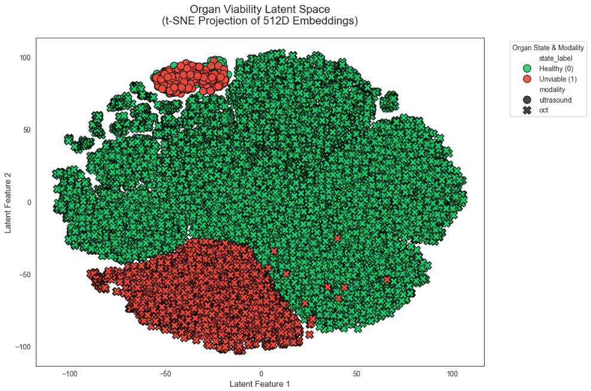
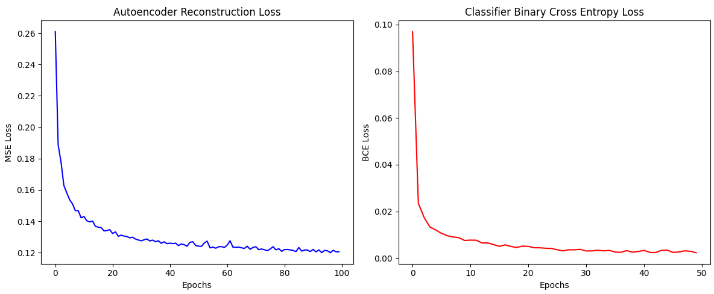

# Integrating D-OCT and Ultrasound Imaging to Determine Organ Viability - 2nd Place at BioHack 2026
This repository presents a multimodal deep learning framework that integrates Dynamic Optical Coherence Tomography (D-OCT) with ultrasound imaging to assess kidney viability in near real time. We developed a custom embedding pipeline to fuse shallow tissue imaging from D-OCT with deep tissue imaging from ultrasound. A neural network trained on these learned embeddings predicts organ viability in under one second.

Our model can efficiently detect:
- Arteriolar fibrosis
- Interstitial fibrosis
- Tubular atrophy

The system delivers clinically relevant information comparable to biopsy, without the associated procedural risk or delay.

## Usage

To use the remade model, run the following code,

```bash
python gui.py
```

### Inputs
This will open up a new python window where you can drag in any picture you desire.

### Outputs
The output from gui.py will be an prediction of the image being a viable or non-viable kidney. In addition, it will output the time it took for the calculation.
- For the non linear result, the output it prints is the object type, but the actual object exists.

## Problem Description 

The challenge at hand was as follows:
Many viable donor organs are discarded or fail after transplant due to subjective viability assessment and inadequate preservation during transport. The lack of real-time, objective metrics, and physiologic monitoring leads to missed transplant opportunities and preventable graft failure despite ongoing organ shortages- how can we extend donor organ viability?

Kidney transplantation currently relies heavily on biopsies for viability assessment. While informative, biopsies are time-consuming, resource-intensive, and increase the risk of organ discard. Additionally, there is no widely adopted real-time tracking system for ex vivo organ evaluation. Dynamic Optical Coherence Tomography (D-OCT) has been commercially used for retinal imaging since 1996 and is well established in ophthalmology. However, it has not yet become a standard tool for kidney evaluation.

## Model Overview
In this project, we model hospital equipment rooms as suppliers and patients as the clients. If there are ```N_rooms``` clients and ```N_supply``` suppliers, then we will have matrices of ```N_supply x N_rooms``` to which we will have to apply constraints and an objective function.


## Code Overview
```gui.py``` - is a python script containing a small gui to put images in
```predict.py``` - is an end-to-end inference pipeline that extracts high-level features from a medical image using a pre-trained ResNet18, compresses them via a custom Autoencoder, and then classifies the result using a trained KidneyClassifier to predict a specific biological state.
```SLL_metrics.py``` - This code implements a semi-supervised transfer learning pipeline specifically designed for kidney medical data. It follows a two-stage process: first learning a compressed representation of the data without labels, and then using those learned features to perform classification.

## Results

To evaluate the quality of our multimodal fusion pipeline, we projected the learned vector embeddings into 2D space using dimensionality reduction. The visualization demonstrates clear clustering between viable and non-viable kidneys, indicating that the model successfully learns separable latent representations from the fused D-OCT and ultrasound data. The distinct grouping in embedding space suggests:
- Effective cross-modality feature fusion
- Strong structural encoding of fibrosis and atrophy markers
- High separability prior to final classification
- This confirms that the learned embedding space itself carries meaningful clinical information.



The training loss curve shows stable convergence with no signs of divergence or instability. The model reaches a low-loss regime efficiently, demonstrating:

- Effective optimization
- No significant overfitting during training
- Smooth convergence behavior



### Classification Performance
The final model achieves:
- ~90% prediction accuracy on held-out validation data
- Near real-time inference (under one second per kidney)
- Significant reduction in evaluation time compared to traditional biopsy workflows (3–10 hours)

These results indicate that multimodal imaging combined with learned embeddings can provide clinically actionable viability assessments with high reliability and speed.

